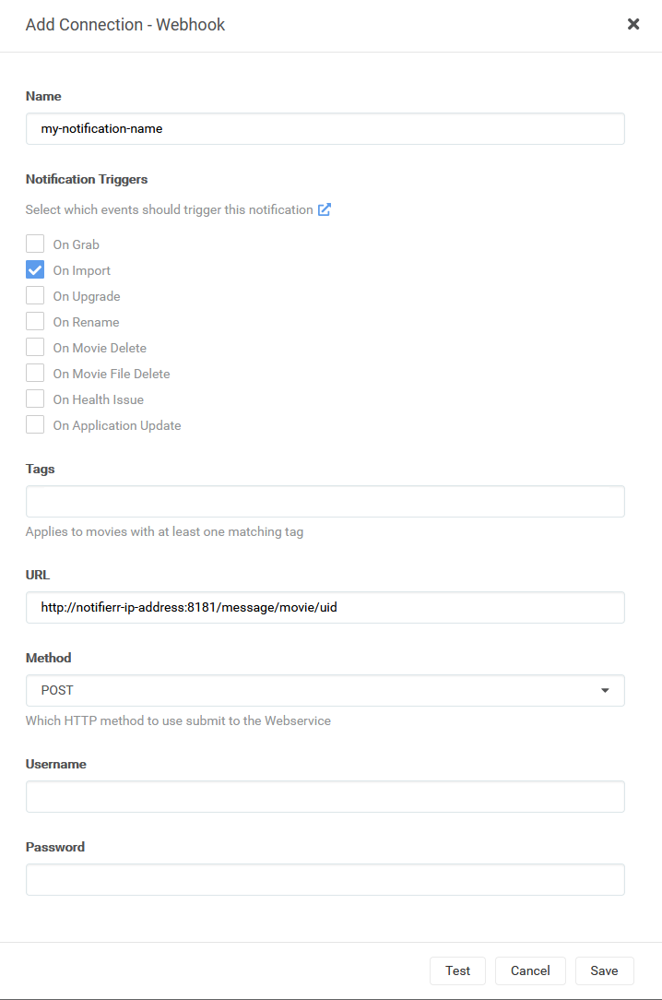
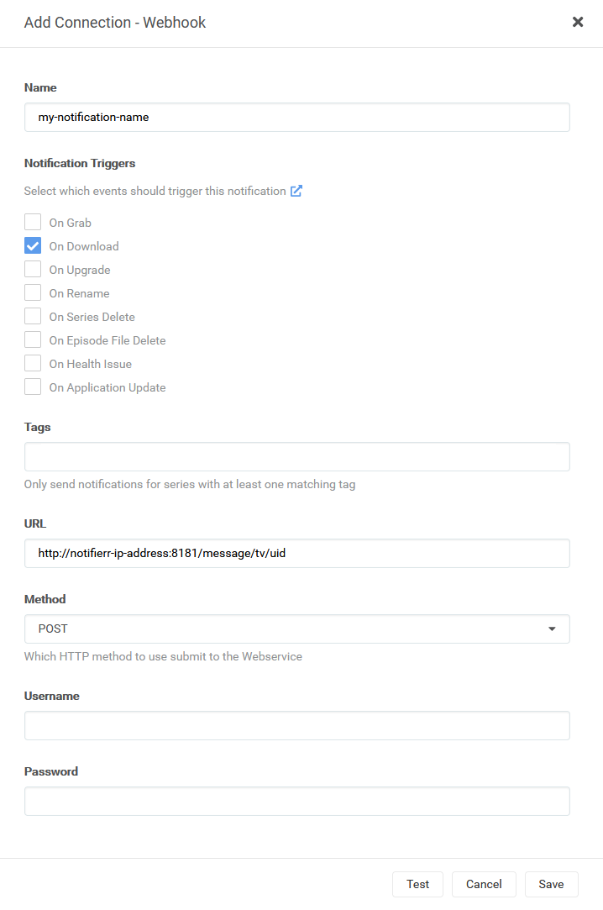

# notifierr
notifierr is an SMS notification service used in conjunction with Radarr/Sonarr to send SMS notifications when movies and TV shows are available to watch.

## Installation
The easiest way to install notifierr is with pip
```sh
python3 -m pip install notifierr
```

You can also clone the repository directly and run setup.py manually
```sh
git clone https://github.com/adamsbytes/notifierr.git
cd notifierr
python3 setup.py install
```

## Usage

### Configuring the Server
You must edit `notifierr/config.py` with your own values before starting the API server. You'll also need to set some environment variables, depending on which SMS provider you're using.

#### *Twilio SMS provider*
The following environment variables are required:

`TWILIO_ACCOUNT_SID`: Twilio account SID

`TWILIO_AUTH_TOKEN`: Twilio auth token

`TWILIO_FROM_NUMBER`: the Twilio phone number you want to send messages from


### Starting the Server

__NOTE__: pip installs may need to add `~/.local/bin` to their PATH

For pip installs:
```sh
notifierr --host 0.0.0.0 --port 8181
```

To manually start the server:
```sh
$appdir/cli.py --host 0.0.0.0 --port 8181
```

### Available API endpoints

`GET /version`: responds with the running version of notifierr

`POST /message/movie/{uid}`: sends a detailed notification message for new movies (Radarr) to the phone numbers associated with uid

`POST /message/tv/{uid}`: sends a detailed notification message for new TV episodes (Sonarr) to the phone numbers associated with uid

## Configuring Radarr/Sonarr

### A high level overview

The app uses the UID portion of `http://ip:8181/message/tv/UID` to select which phone numbers to use for the message. These are configured in the app's `config.py` file.

To have granular control over which numbers are messaged about which downloads, use **Tags** in Radarr/Sonarr!

For example, to let Dave know when his favorite show is ready, put his number in the `config.py` with any UID you'd like. Tag Dave's show with a unique tag, then create a notification that triggers with that same tag and use a URL containing Dave's UID at the end.

### A step by step walkthrough

Once notifierr is running, in Radarr/Sonarr, visit Settings > Connect and create a new Connection.

For the connection type, select `Webhook`

For the notification triggers, choose `On Download` or `On Import` (depending on the option available)

For the URL, enter `http://notifierr-ip-address:8181/message/tv/$uid`, replacing `$uid` with the UID you entered in `config.py` to correspond with the numbers who should receive the message

For the method, select `POST`

Press `Test` to validate the connection, then press `Save`.

### A picture is worth a thousand words

#### Radarr Configuration Picture


#### Sonarr Configuration Picture
